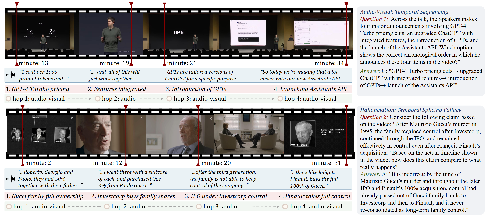
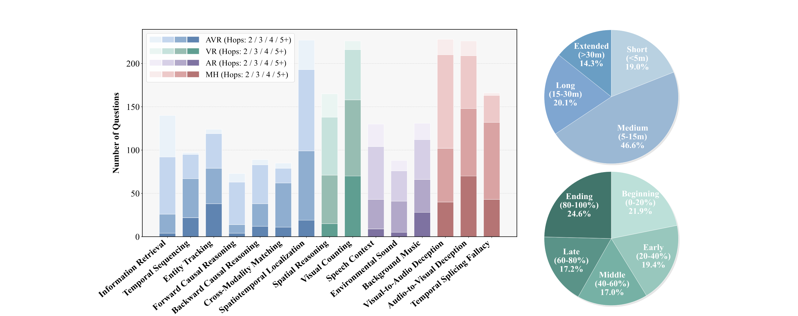
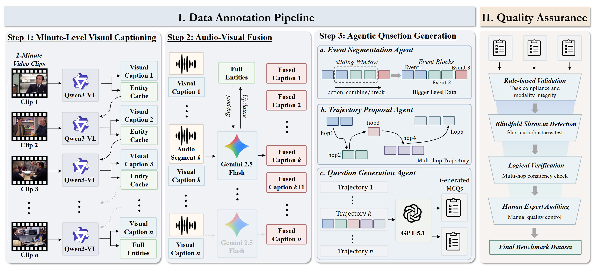
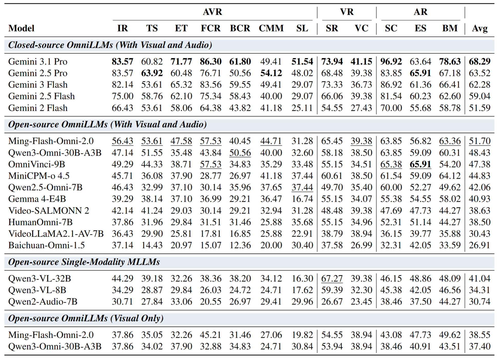
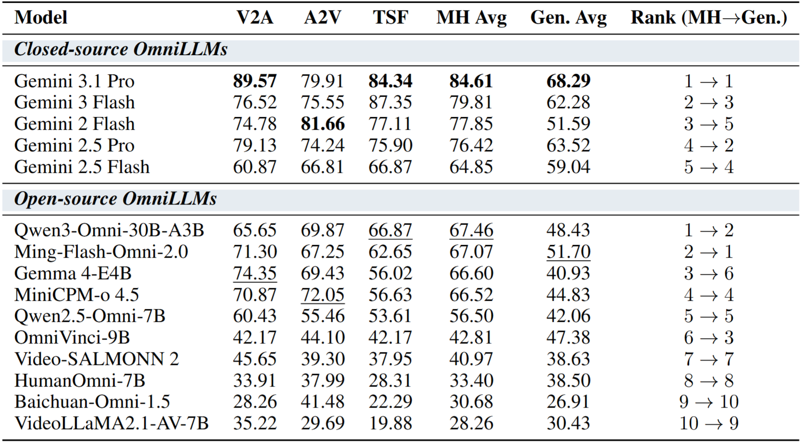

<div align="center">

<!--  -->

# TraceAV-Bench: Benchmarking Multi-Hop Trajectory Reasoning over Long Audio-Visual Videos


[](https://heinz217.github.io/TraceAV-Bench-Page/)
[](https://huggingface.co/datasets/Heinz217/TraceAV-Bench)
[](#)
[](assets/TraceAV-Bench.pdf)
[](https://creativecommons.org/licenses/by/4.0/)

</div>

---

**TraceAV-Bench** is the first benchmark to jointly evaluate *multi-hop reasoning over long audio-visual trajectories* and *multimodal hallucination robustness*. It contains **2,200** trajectory-grounded multiple-choice questions over **578** long videos (**339.5 hours** total), organized into **4 evaluation dimensions** and **15 sub-tasks**. Every question is grounded in an explicit reasoning chain that averages **3.68 hops** across a **15.1-minute** temporal span.

<p align="center">
  
</p>

## ✨ Highlights

- **Ultra-long videos.** Each video runs from 606 s to 8,394 s with an average of ~35 min, making this the only benchmark whose mean video duration exceeds 30 minutes.
- **Explicit multi-hop trajectories.** Every question is grounded in a temporally dispersed, cross-modal evidence chain.
- **4 dimensions × 15 sub-tasks.** Audio-Visual Joint Reasoning (7 sub-tasks), Visual-Centric Reasoning (2 sub-tasks), Audio-Centric Reasoning (3 sub-tasks), plus a dedicated Multimodal Hallucination dimension (3 sub-tasks).
- **Hallucination test.** V2A deception, A2V deception, and temporal splicing fallacy.

## 🧩 Sub-Tasks

The 15 sub-tasks span four dimensions, encoded as a prefix in every `task_type` and every filename: `av_*` (AVR), `v_*` (VR), `a_*` (AR), `mh_*` (MH).

<p align="center">
  
</p>

| Dim | Task file (= `task_type`)             | Sub-task (abbrev.)                | Videos | Questions |
|-----|---------------------------------------|-----------------------------------|-------:|----------:|
| AVR | `av_information_retrieval.json`       | Information Retrieval (IR)        |  140 |  140 |
| AVR | `av_temporal_sequencing.json`         | Temporal Sequencing (TS)          |   95 |   97 |
| AVR | `av_entity_tracking.json`             | Entity Tracking (ET)              |  116 |  124 |
| AVR | `av_forward_causal_reasoning.json`    | Forward Causal Reasoning (FCR)    |   73 |   73 |
| AVR | `av_backward_causal_reasoning.json`   | Backward Causal Reasoning (BCR)   |   84 |   89 |
| AVR | `av_cross_modality_matching.json`     | Cross-Modality Matching (CMM)     |   84 |   85 |
| AVR | `av_spatiotemporal_localization.json` | Spatiotemporal Localization (SL)  |  225 |  227 |
| VR  | `v_spatial_reasoning.json`            | Spatial Reasoning (SR)            |  165 |  165 |
| VR  | `v_visual_counting.json`              | Visual Counting (VC)              |  219 |  226 |
| AR  | `a_speech_context.json`               | Speech Context (SC)               |  121 |  130 |
| AR  | `a_environmental_sound.json`          | Environmental Sound (ES)          |   88 |   88 |
| AR  | `a_background_music.json`             | Background Music (BM)             |  120 |  131 |
| MH  | `mh_visual_to_audio_deception.json`   | Visual-to-Audio Deception (V2A)   |  218 |  230 |
| MH  | `mh_audio_to_visual_deception.json`   | Audio-to-Visual Deception (A2V)   |  220 |  229 |
| MH  | `mh_temporal_splicing_fallacy.json`   | Temporal Splicing Fallacy (TSF)   |  151 |  166 |

## 📁 Repository Layout

```
TraceAV-Bench/
├── assets/             # Figures and the SVG logo
├── data_examples/      # 4 small example files showing the exact JSON schema
├── src/                # Benchmark construction pipeline (4 stages)
└── eval/               # Per-model evaluators and launchers
```

> The full benchmark data is **not** stored in this repository. Download it from the
> [Hugging Face dataset](https://huggingface.co/datasets/Heinz217/TraceAV-Bench).
> See [Quick Start](#quick-start) below.

## 🚀 Quick Start

### 1. Clone the repository

```bash
git clone https://github.com/Heinz217/TraceAV-Bench.git
cd TraceAV-Bench
```

### 2. Download the benchmark data

Pull all 15 task files plus `video_name_mapping.json` from the Hugging Face dataset
into a local `data/` directory:

```bash
huggingface-cli download \
    Heinz217/TraceAV-Bench \
    --repo-type dataset \
    --local-dir ./data \
    --local-dir-use-symlinks False
```

Or programmatically:

```python
from datasets import load_dataset

ds = load_dataset(
    "Heinz217/TraceAV-Bench",
    name="av_information_retrieval",   # any of the 15 sub-task config names
    split="train",
)
print(ds[0])
```

### 3. Download the source videos

Video files are **not** hosted in this repository or on Hugging Face. Resolve every
`video_id` referenced in `data/*.json` through `data/video_name_mapping.json`:

- If `source = "omnivideobench"`, download the file from the official
  [OmniVideoBench](https://github.com/NJU-LINK/OmniVideoBench) release. The `id`
  matches their internal filename.
- Otherwise, `id` is a YouTube video id. Fetch the video from
  `https://www.youtube.com/watch?v=<id>`.

Save every file as `<video_id>.mp4` in a single flat directory (e.g. `~/traceav_videos/`).
All evaluators locate videos by this layout through a `*_VIDEOS_DIR` environment variable
defined in their launcher.

### 4. Run an evaluator

```bash
# Closed-source API (Gemini)
export BENCHMARK_DIR=$(pwd)/data
export GEMINI_API_KEY=<your_key>
bash eval/gemini/eval_gemini.sh

# Local Hugging Face checkpoint (Qwen3-VL)
export QWEN3VL_MODEL_PATH=/path/to/Qwen3-VL-32B-Instruct
export QWEN3VL_CLEANED_DIR=$(pwd)/data
export QWEN3VL_VIDEOS_DIR=/path/to/videos
bash eval/qwen3_vl/eval_qwen3_vl.sh

# OpenAI-compatible server (e.g. vLLM-hosted Qwen3-Omni)
export BENCHMARK_DIR=$(pwd)/data
export LVBENCH_BASE_URL=http://127.0.0.1:8000
bash eval/qwen3_omni/eval_qwen3_omni.sh
```

See [`eval/README.md`](eval/README.md) for the full list of supported models and
their environment variables.

## 📑 Data Format

Each task file is a single JSON of the following shape (parsed examples are
available under [`data_examples/`](data_examples/)):

```jsonc
{
  "task_type": "v_visual_counting",
  "video_count": 219,
  "question_count": 226,
  "items": [
    {
      "question_id": 1,
      "video_id": "video2",
      "question": "...",
      "options": {"A": "...", "B": "...", "C": "...", "D": "..."},
      "question_type": "single",          // "single" | "multiple"
      "correct_options": ["C"],
      "answer_text": "...",
      "minute_hop_count": 40,             // temporal span (minutes)
      "hop_length_label": "long",         // "short" | "medium" | "long"
      "trajectory_with_timestamps": [
        {
          "event_id": 6,
          "evidence": "...",
          "label": "visual",              // "visual" | "audio" | "audio-visual"
          "reason": "...",
          "timestamp_minute": 42,
          "event_time_range": {"start_minute": 41, "end_minute": 44}
        }
      ],
      "difficulty": "medium"              // "easy" | "medium" | "hard"
    }
  ]
}
```

> **Note on the Hugging Face copy.** The exact same content is hosted on Hugging
> Face, but for compatibility with the `datasets` viewer the nested fields
> (`options`, `correct_options`, `trajectory_with_timestamps`) are stored as JSON
> *strings* there. Parse them back with `json.loads`.

## 🛠️ Benchmark Construction Pipeline

A three-step semi-automated pipeline followed by a strict quality assurance stage.

<p align="center">
  
</p>

| Stage | Folder                                  | What it produces                             |
|-------|-----------------------------------------|----------------------------------------------|
| 1     | `src/step1_visual_captioning/`          | Minute-level visual captions with an entity cache for long-range identity tracking. |
| 2     | `src/step2_audio_visual_fusion/`        | Asynchronous audio-visual fusion that aligns 1-minute audio with the visual narrative. |
| 3     | `src/step3_agentic_question_generation/`| Event segmentation, trajectory proposal, and MCQ generation over explicit multi-hop evidence. |
| 4     | `src/step4_quality_assurance/`          | Multi-stage verification: blindfolded solver, deduplication, and LLM-based filtering. |

## 🏆 Leaderboard

A snapshot of the evaluation results on TraceAV-Bench is shown below. For the live, sortable leaderboard with per-task breakdowns and submission instructions, jump to the project page:

<p align="center">
  <a href="https://heinz217.github.io/TraceAV-Bench-Page/#leaderboard">
    
  </a>
</p>

**Evaluation results across different task types.** Accuracy (%) on the 12 general sub-tasks across the AVR / VR / AR dimensions.

<p align="center">
  
</p>

**Evaluation results of different OmniLLMs on hallucination robustness.** Accuracy (%) on the 3 MH sub-tasks together with their MH Avg and Gen. Avg.

<p align="center">
  
</p>

## 📜 License and Terms of Use

The TraceAV-Bench annotations and accompanying code are released under the
[**CC BY 4.0**](https://creativecommons.org/licenses/by/4.0/) license.

> **ℹ️ Attribution required.** When you use TraceAV-Bench in published work,
> derivative datasets, or downstream applications, please credit the authors by
> citing the paper (see [Citation](#-citation)) and linking back to this
> repository or the [Hugging Face dataset](https://huggingface.co/datasets/Heinz217/TraceAV-Bench).

**Takedown requests.** If you are an author or rights-holder of a video that you
believe should not be referenced by TraceAV-Bench, please open an issue on this
repository or contact us at **<hengyifeng.0118@gmail.com>**, and we will remove
the corresponding entries promptly.
